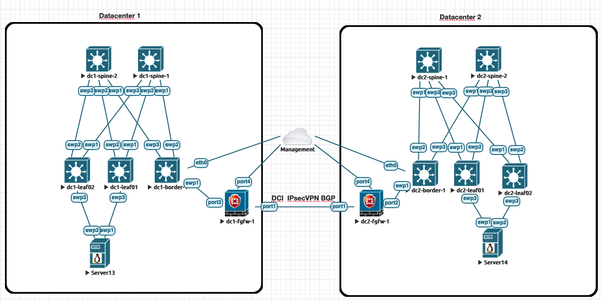

# evpn-ipsec-dci-ansible
evpn-ipsec-dci-ansible

This is a topology the has two datacenters using a SPINE and LEAF network desing.
Interconnceted by 2 Fortigate Firewalls using BGP over an IPSec tunnel.

The Automation of the topology is done in Ansible.

Roles have been defined for the different service functions in the topology.
- SPINE Role
- LEAF Role
- EXIT Role

Defined are playbooks:
- Firewall:
  This playbook is specific to FortiGate Firewalls
- Spines:
  This playbook uses the spine role from roles/spine which configures EVPN fabric spine switches.
  Also combined with the common role from roles/common to setup basic configurations for NTP and Syslog.
- Leafs:
  This playbook uses the leaf role from roles/leaf which configures EVPN fabric leaf switches.
  Also combined with the common role from roles/common to setup basic configurations for NTP and Syslog.
- Borders
  This playbook uses the leaf role from roles/leaf which configures EVPN fabric leaf switches.
  Also combined with the common role from roles/common to setup basic configurations for NTP and Syslog.

